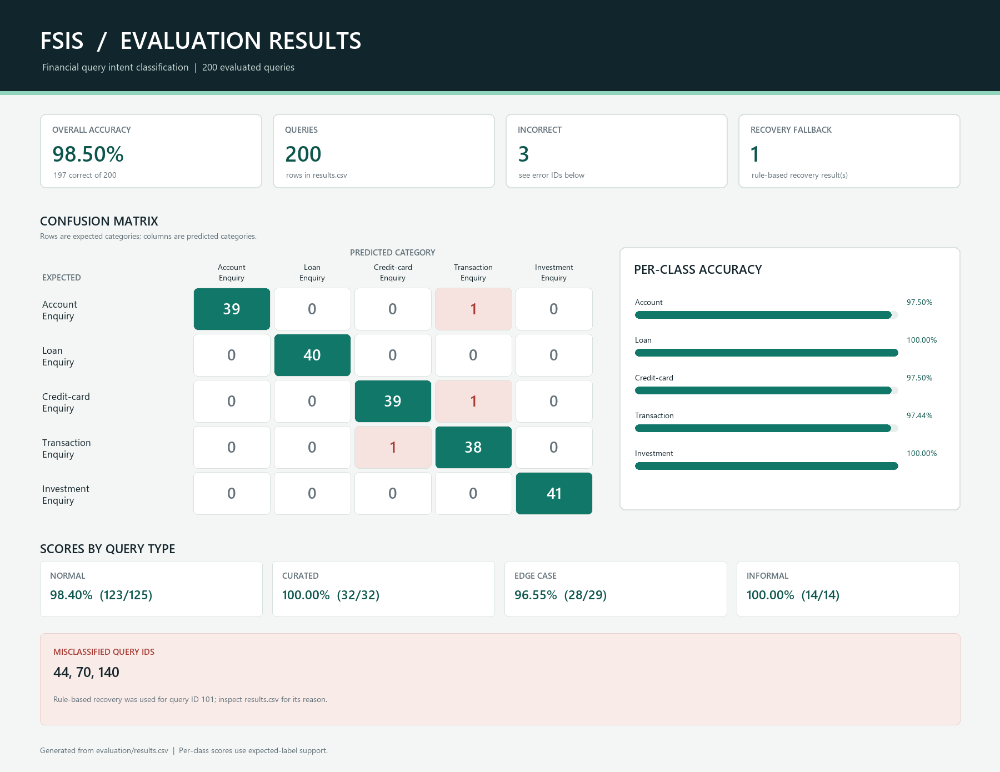

# Financial Services Intelligent System (FSIS)

FSIS is a Flask web application that classifies financial customer-service questions by their primary intent. It combines a browser dashboard, user accounts, query history, administrator views, feedback collection, SQLite storage, and a Groq-hosted language model with an offline keyword-based fallback.

> FSIS classifies intent for routing and evaluation. It does not access bank accounts, process transactions, or provide financial advice.

## Features

- Sign up, sign in, and sign out using Flask sessions.
- Classify submitted queries into one of five financial intents.
- Use Groq for live classification or deterministic keyword rules for offline demos and tests.
- Store query text, category, reason, model name, and timestamp.
- Review and filter query history; administrators can view all users' records.
- Submit correctness feedback on a classification.
- Evaluate predictions against a curated CSV and generate a confusion matrix and results image.

## Categories

| Category | Typical intent |
| --- | --- |
| `Account Enquiry` | Bank account access, balances, statements, KYC, or account maintenance. |
| `Loan Enquiry` | Loan eligibility, applications, EMIs, repayments, interest, or loan status. |
| `Credit-card Enquiry` | Credit card limits, statements, bills, rewards, PINs, fees, or card operations. |
| `Transaction Enquiry` | Specific payments, transfers, UPI/NEFT/RTGS/IMPS, pending/failed/reversed transactions. |
| `Investment Enquiry` | Mutual funds, SIPs, shares, bonds, ETFs, portfolios, and investment products or risks. |

## How It Works

1. The user submits query text from the dashboard.
2. Flask checks the session and validates that the query is non-empty and no longer than 1,000 characters.
3. `llm_service.py` classifies it using Groq or the local weighted keyword rules.
4. Flask validates the category, stores the query and classification in SQLite, and returns the result to the browser.
5. The user can review history and submit feedback. Feedback is stored but does not train or change the classifier.

The Groq prompt requests a category and a short reason in JSON. If a model request or response parse fails, the service retries and may use the rule-based recovery classifier. Missing credentials do not automatically enable offline mode; set `MOCK_MODE=true` to run without Groq.

The fallback is hand-written weighted keyword/phrase logic, not a model trained on the CSV. It adds scores for matching phrases and extra rules for common conflicts, then chooses the highest-scoring category. If no rule matches, it defaults to `Account Enquiry`.

## Project structure

```text
FSIS/
├── app.py                         # Flask app, routes, database models, sessions
├── config.py                      # Settings module (currently not imported)
├── extensions.py                  # Reserved for future extensions
├── llm_service.py                 # Groq integration and keyword fallback
├── requirements.txt
├── .env.example                   # Environment template; do not commit .env
├── setup.bat / run.bat            # Windows helpers
├── templates/                     # Jinja pages
├── public/static/                 # Vercel CDN assets; Flask local static URL is /static
│   ├── css/style.css
│   └── js/app.js
├── vercel.json                    # Flask function/template configuration
├── data/
│   ├── financial_queries.csv      # 200 labeled examples
│   └── SOURCES.md                 # Dataset sources and methodology
├── evaluation/
│   ├── evaluate_model.py
│   ├── results.csv
│   ├── confusion_matrix.py
│   ├── confusion_matrix.txt
│   ├── generate_results_image.py
│   ├── results_visualization.png
│   └── live_query_examples.csv
├── tests/test_api.py
├── PROJECT_CHECKLIST.md
└── PROJECT_REPORT.md
```

The local `.env`, `.venv/`, `instance/`, and cache files are machine-specific or generated and are intentionally not part of this tree.

## Quick Start

Use Python 3.10 or newer. From the project directory, create a virtual environment, install dependencies, and copy the environment template once:

```powershell
py -m venv .venv
.\.venv\Scripts\Activate.ps1
python -m pip install --upgrade pip
python -m pip install -r requirements.txt
Copy-Item .env.example .env
```

Edit `.env` before starting the app. For an offline demo, set `MOCK_MODE=true`. Set a private `SECRET_KEY` and `ADMIN_PASSWORD`, and disable Flask debug mode when it is not needed. Start the application:

```powershell
python app.py
```

Open <http://127.0.0.1:5000> in a browser. The root route redirects to the dashboard when signed in and to login when signed out.

`setup.bat` is an alternative first-time setup helper. It creates/activates `.venv`, installs dependencies, and then force-copies `.env.example` over `.env`. Running it again can overwrite local settings or credentials. `run.bat` creates `.venv` if needed, reinstalls requirements, and starts the app; it does not create `.env`.

### Administrator Account

The app seeds an administrator from `ADMIN_EMAIL` and `ADMIN_PASSWORD`. Development defaults are `admin@fsis.local` and `Admin@1234`. The seed routine resets the seeded account's password on each app initialization to the configured value. Override these defaults before sharing or deploying the app.

## Configuration

`.env.example` lists the supported environment variables:

| Variable | Purpose | Example/default |
| --- | --- | --- |
| `SECRET_KEY` | Signs Flask session cookies. | Replace the placeholder with a random private secret. |
| `DATABASE_URL` | SQLAlchemy connection URL. | `sqlite:///fsis.db` (stored under Flask's `instance/` folder). |
| `MOCK_MODE` | Selects offline rules or live Groq. | `true` for offline; `false` for live. |
| `GROQ_API_KEY` | Credential for live Groq requests. | Keep private; never commit it. |
| `GROQ_MODEL` | Groq model identifier. | `openai/gpt-oss-20b` |
| `QUERY_MAX_LENGTH` | Maximum query length. | `1000` |
| `FLASK_DEBUG` | Enables Flask debug mode. | Example is `true`; disable outside local development. |
| `ADMIN_EMAIL` | Seed administrator email. | `admin@fsis.local` |
| `ADMIN_PASSWORD` | Seed administrator password. | Set a private value. |

Generate a local session secret with:

```powershell
python -c "import secrets; print(secrets.token_hex(32))"
```

Set the output as `SECRET_KEY` in `.env`. Explicitly set `MOCK_MODE`; `llm_service.py` defaults to live mode if the variable is absent, while `.env.example` explicitly selects offline mode. `config.py` currently exists but is not imported by the app.

## Deploying to Vercel

Vercel detects the Flask application from the root `app.py`. The included `vercel.json` makes sure Jinja templates are packaged with the function. Frontend files are in `public/static/`, which Vercel serves at the existing `/static/...` URLs.

**Use persistent PostgreSQL.** Vercel functions do not provide durable local SQLite storage. Provision Neon PostgreSQL through the Vercel Marketplace/Storage integration, then configure its connection URL as `DATABASE_URL` in the Vercel project settings for Preview and Production. Do not put the database URL in Git or paste it into chat. The app converts standard `postgresql://` or `postgres://` URLs to the installed psycopg driver format and fails fast on Vercel if SQLite is selected.
**Use persistent PostgreSQL.** Vercel functions do not provide durable local SQLite storage. Connect the Neon resource to the project with the `NEON_` prefix for Preview and Production; the integration will provide `NEON_DATABASE_URL`. The app prefers this variable over `DATABASE_URL`, leaving any existing database setting untouched. Do not put database URLs in Git or paste them into chat. The app converts standard PostgreSQL URLs to the psycopg driver format and fails fast on Vercel if SQLite is selected.
Vercel startup also requires a `SECRET_KEY` of at least 32 characters, a non-default `ADMIN_EMAIL`, and an `ADMIN_PASSWORD` of at least 12 characters. Set `MOCK_MODE=false` and `FLASK_DEBUG=false` in the Vercel project settings for live classification without debug mode.

Configure these Vercel environment variables:

| Variable | Value |
| --- | --- |
| `NEON_DATABASE_URL` | Neon PostgreSQL connection URL added by the Vercel integration using the `NEON_` prefix. |
| `SECRET_KEY` | A newly generated random secret. |
| `GROQ_API_KEY` | Your Groq API key. |
| `MOCK_MODE` | `false` for live Groq classification. |
| `GROQ_MODEL` | `openai/gpt-oss-20b` (or your selected Groq model). |
| `ADMIN_EMAIL` | The administrator email to seed. |
| `ADMIN_PASSWORD` | A strong, unique administrator password. |
| `FLASK_DEBUG` | `false`. |

After linking the GitHub repository and setting its environment variables, deploy from the project directory:

```powershell
npx vercel login
npx vercel link
npx vercel
npx vercel --prod
```

The first `npx vercel` creates a Preview deployment; `npx vercel --prod` creates the Production deployment. Authentication and database credentials belong in Vercel's secure account/project settings, not in source control.

## Pages And API

  ### Browser Pages

  | Path | Description |
  | --- | --- |
  | `/login` | Sign in. |
  | `/signup` | Create an account. |
  | `/dashboard` | Submit queries, view classifications, and leave feedback. |
  | `/history` | Search and filter personal query history; admins see all records. |
  | `/admin` | Admin-only user/query counts and query table. |

  ### JSON Endpoints

  | Method and path | Access | Purpose |
  | --- | --- | --- |
  | `GET /api/health` | Public | Simple service liveness response. |
  | `POST /api/signup` | Public | Create an account; accepts JSON or form data. |
  | `POST /api/login` | Public | Authenticate and create a session. |
  | `POST /api/logout` | Public | Clear the session. |
  | `POST /api/classify` | Signed in | Classify and persist a query. |
  | `GET /api/history` | Signed in | Return personal history or all history for an admin. Supports `category` and `search` filters. |
  | `POST /api/feedback` | Signed in | Create or update feedback for an owned query; admins may submit feedback for any query. |

  Example classification request:

  ```json
  {
    "query": "Why was my UPI payment debited but the recipient did not receive it?"
  }
  ```

  Successful `/api/classify` response shape:

  ```json
  {
    "success": true,
    "query_id": 12,
    "category": "Transaction Enquiry",
    "reason": "The user is inquiring about a specific UPI payment that was debited from their account but the recipient did not receive it.",
    "model": "openai/gpt-oss-20b"
  }
  ```

  The API response key is `model`; the database field and internal classifier result use `model_name`.

  ## Database

  Flask-SQLAlchemy manages four SQLite tables:

  - `users`: profile, unique email, password hash, admin flag, and creation time.
  - `queries`: owner, original query text, and creation time.
  - `classifications`: one category/reason/model result per query.
  - `feedback`: one correctness flag and optional note per query.

  The local database is normally created under `instance/fsis.db`. `db.create_all()` initializes missing tables; this project does not include a full migration framework. SQLite is intended for local and academic use; use a production database and migrations before deployment.

  ## Data And Evaluation

  `data/financial_queries.csv` contains 200 curated and manually labeled examples across the five categories. The examples were researched from public financial information, paraphrased/curated, manually labeled, or written as edge cases. They are not raw customer records or a verbatim web scrape. See [data/SOURCES.md](data/SOURCES.md) for methodology and source URLs.

Dataset composition: Account Enquiry 40, Loan Enquiry 40, Credit-card Enquiry 40, Transaction Enquiry 39, and Investment Enquiry 41. Query styles are Normal 125, Curated 32, Edge case 29, and Informal 14.

  The latest saved live evaluation used `MOCK_MODE=false` and `openai/gpt-oss-20b`:

  - **197 / 200 correct (98.50%)**
  - Account Enquiry: 39/40 (97.50%)
  - Loan Enquiry: 40/40 (100.00%)
  - Credit-card Enquiry: 39/40 (97.50%)
  - Transaction Enquiry: 38/39 (97.44%)
  - Investment Enquiry: 41/41 (100.00%)
  - Query ID 101 used the rule-based recovery fallback and was still correct; there were no API error rows.

  These are results from one run on this curated assignment dataset, not a guarantee of future or production accuracy. The three mistakes were ID 44 (credit-card payment settlement), ID 70 (stopping payment on an issued cheque), and ID 140 (disputing an unauthorized card cash withdrawal). The detailed predictions and reasons are in [evaluation/results.csv](evaluation/results.csv). Five real live model examples are saved in [evaluation/live_query_examples.csv](evaluation/live_query_examples.csv).

  ### Evaluation Image

  The generated image summarizes overall accuracy, the confusion matrix, per-class accuracy, query-type scores, and misclassified query IDs:

  

  Regenerate the evaluation data and visual artifacts with:

  ```powershell
  python evaluation/evaluate_model.py
  python evaluation/confusion_matrix.py
  python evaluation/generate_results_image.py
  ```

  `evaluate_model.py` sends all dataset rows through the Flask API and overwrites `evaluation/results.csv`. In mock mode the scores measure the local rules; in live mode a valid Groq API key is required. `confusion_matrix.py` prints the matrix to the terminal; the committed text snapshot is `evaluation/confusion_matrix.txt`. `generate_results_image.py` reads the results CSV and writes `evaluation/results_visualization.png` using Pillow. Run all three after a new evaluation to refresh all outputs.

  ## Tests

  Run the API and behavior tests with:

  ```powershell
  python -m pytest -q
  ```

  The pytest suite uses Flask's test client, temporary SQLite databases, and `MOCK_MODE=true`. It covers authentication, admin access, classification, history filters, feedback, invalid categories, and response parsing. It does not send live Groq requests.

  For a more detailed explanation of modules, data relationships, algorithms, verified evaluation, and likely viva questions, see [PROJECT_REPORT.md](PROJECT_REPORT.md).

  ## Security And Limitations

  - Never commit `.env`, Groq API keys, local SQLite records, or real customer information. `.gitignore` excludes `.env`, `.env.local`, `instance/`, virtual environments, and caches.
  - Replace the development session secret and administrator credentials; disable Flask debug mode before deployment.
  - `setup.bat` overwrites `.env` when run, so use it only for initial setup or when intentionally resetting configuration.
  - The application has no explicit CSRF tokens, rate limiting, account verification, or password reset flow.
  - The keyword fallback is heuristic and defaults unmatched text to Account Enquiry. Live LLM results may also be wrong.
  - Do not use FSIS for financial advice, account access, or transaction processing.
